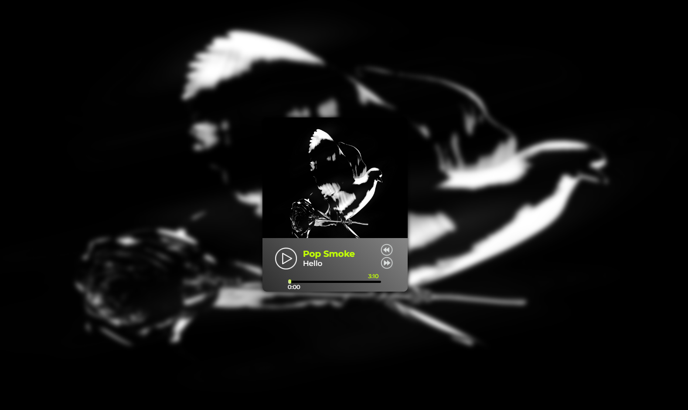

# audio-player

## Описание проекта

AudioPlayer - Музыкальный плеер, позволяющий по очереди проигрывать музыкальные треки или перелистывать их кликами по кнопкам. Каждому музыкальному треку соответствует определённое фоновое изображение.

<kbd></kbd>

- Вёрстка состоит из одного главного блока: `
`
  
[Деплой проекта](https://zixail28.github.io/audio-player/)  
